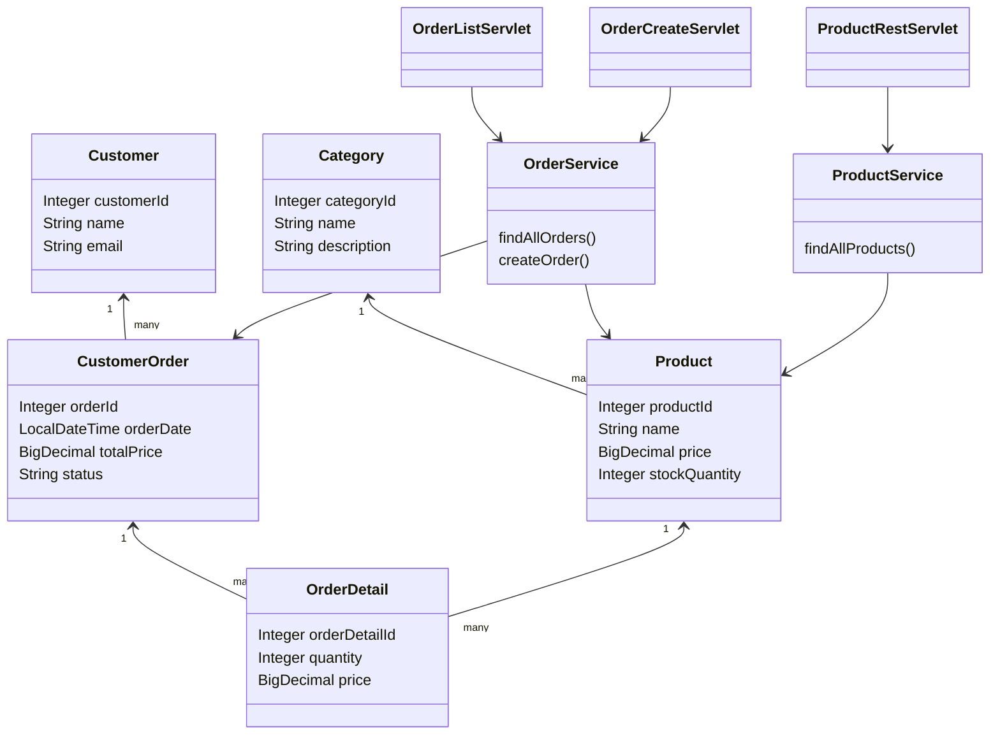

# Лабораторная работа 5. Web-приложения (сервлеты)

**Студентка:** Севрюкова Валерия Сергеевна  
**Группа:** 12002453  
**Дисциплина:** Разработка кроссплатформенных приложений  
**Тема:** сервлеты, WAR, Tomcat, простой REST

## Цель

Нужно было добавить к магазину зоотоваров веб-часть: страницы с заказами и REST по продуктам. Раньше всё крутилось только в консоли, теперь можно открыть в браузере.

## Что сделано

1. На основе ЛР4 (JPA + Spring Data) я собрала проект в `les10/lab`.
2. Установила Apache Tomcat 11, в `tomcat-users.xml` добавила пользователя `admin` / `admin` с ролями `manager-gui` и `admin-gui`.
3. В Gradle подключила плагин `war`, на выходе получается `pet-store.war`.
4. Сервлет списка заказов (`/orders`) — таблица заказов и кнопка «Создать заказ».
5. Сервлет формы (`/orders/new`) — выбираю клиента, товар и количество. После POST редирект обратно на список.
6. REST сервлет (`/api/products`) — JSON: название товара, категория, остаток на складе.
7. Собрала приложение командой `gradle war`.
8. WAR положила в `webapps` Tomcat, REST проверила через Postman (GET).

Данные для категорий/товаров/клиентов я загружаю из CSV (как в прошлых лабах).

## Как запустить

```text
cd les10/lab
gradle war
```

WAR лежит тут: `build/libs/pet-store.war`.

Дальше:
1. Скачать Tomcat 11 с https://tomcat.apache.org/
2. Прописать admin в `conf/tomcat-users.xml`
3. Скопировать `pet-store.war` в `webapps`
4. Запустить `bin/startup.bat`
5. Открыть:
   - http://localhost:8080/pet-store/orders
   - http://localhost:8080/pet-store/orders/new
   - http://localhost:8080/pet-store/api/products

Manager: http://localhost:8080/manager/html (логин admin / admin)

## Проверка REST (Postman)

Метод: **GET**  
URL: `http://localhost:8080/pet-store/api/products`  

В ответе массив объектов примерно такого вида:

```json
[
  {
    "name": "Сухой корм для собак",
    "category": "Корма",
    "stockQuantity": 50
  }
]
```

## Структура пакетов

- `ru.bsuedu.cad.lab.entity` — сущности
- `ru.bsuedu.cad.lab.repository` — репозитории Spring Data
- `ru.bsuedu.cad.lab.service` — заказы и продукты
- `ru.bsuedu.cad.lab.servlet` — сервлеты
- `ru.bsuedu.cad.lab.bootstrap` — загрузка CSV при старте

Spring поднимается через `ContextLoaderListener` в `web.xml`. Из сервлета бины достаю через `WebApplicationContextUtils`.

## UML (классы)



## Вывод

В итоге у меня получилось простое веб-приложение на сервлетах. Список и создание заказов открываются в браузере, продукты отдаются по REST в JSON. Сборку в WAR и деплой на Tomcat 11 я проверила — всё работает.

## Вопросы к защите (кратко для себя)

1. Servlet — Java-класс, который обрабатывает HTTP-запросы.
2. `web.xml` — описывает сервлеты, listener’ы и mapping’и.
3. WAR — архив веб-приложения, JAR больше для обычных библиотек/приложений.
4. `ServletContext` — общее хранилище для всего приложения.
5. Request — то что пришло от клиента, Response — что отправляем обратно.
6. Для старта контекста обычно `ServletContextListener`.
7. В сервлете Spring-контекст беру через `WebApplicationContextUtils`.
8. `ContextLoaderListener` поднимает корневой Spring ApplicationContext.
9. `@WebServlet` удобнее, но в лабе сделала через `web.xml`, как в демо.
10. Один бин можно использовать в нескольких сервлетах — это один и тот же Spring bean.
