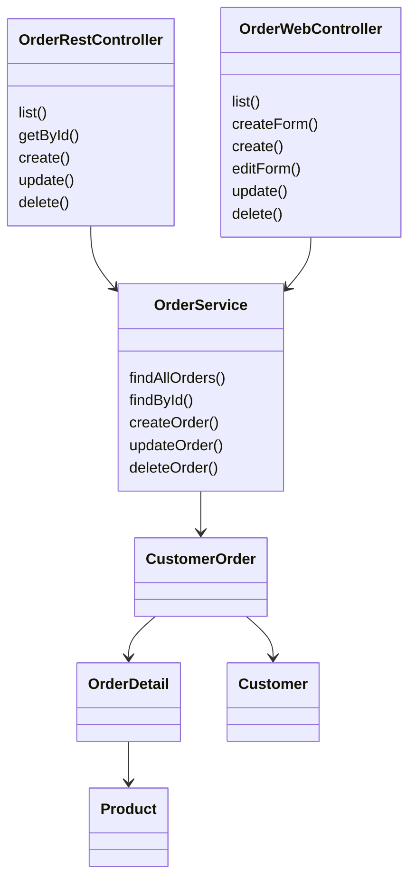

# Лабораторная работа 6. Spring MVC

**Студентка:** Севрюкова Валерия Сергеевна  
**Группа:** 12002453  
**Тема:** Spring MVC, REST, Thymeleaf

## Цель

Переделать магазин зоотоваров со сервлетов на Spring MVC. Сделать REST API по заказам и нормальный веб-интерфейс через Thymeleaf.

## Что сделала

1. Скопировала результат ЛР5 в `les12/lab`.
2. Настроила Spring MVC: `DispatcherServlet` через `AppInitializer`, конфиг `WebConfig` с `@EnableWebMvc`.
3. Сделала REST API заказов на `@RestController`:
   - `GET /api/orders` — список
   - `GET /api/orders/{id}` — один заказ
   - `POST /api/orders` — создание
   - `PUT /api/orders/{id}` — изменение
   - `DELETE /api/orders/{id}` — удаление
4. Подключила Thymeleaf и сделала страницы:
   - список заказов
   - создание
   - изменение
   - удаление
5. Собрала WAR командой `gradle war`.
6. Развернула на Tomcat 11 и проверила REST в Postman. Коллекция лежит в `postman/orders-api.postman_collection.json`.

## Как запустить

```text
cd les12/lab
gradle war
```

WAR: `build/libs/pet-store.war`

Положить в `webapps` Tomcat 11 и открыть:

- http://localhost:8080/pet-store/orders
- http://localhost:8080/pet-store/api/orders

## Postman

Импортировать файл `postman/orders-api.postman_collection.json`.  
Там есть GET/POST/PUT/DELETE для заказов.

Пример создания:

```json
{
  "customerId": 1,
  "productId": 1,
  "quantity": 2,
  "status": "NEW"
}
```

## Структура

- `controller` — REST и веб-контроллеры
- `service` — бизнес-логика заказов
- `entity` / `repository` — как в прошлой лабе
- `templates` — html для Thymeleaf
- `dto` — запросы/ответы для REST

## UML



## Вывод

Перешла со сервлетов на Spring MVC. REST по заказам работает, веб-интерфейс на Thymeleaf тоже. Сборка в WAR и деплой на Tomcat проходят нормально.

## Вопросы к защите (коротко)

1. MVC — Model, View, Controller.
2. `DispatcherServlet` принимает запросы и раскидывает по контроллерам.
3. `@Controller` / `@RestController`.
4. `@RestController` сразу отдаёт тело ответа (JSON), `@Controller` обычно отдаёт view.
5. `@PathVariable`.
6. `Model` — данные для шаблона.
7. `@RequestMapping` задаёт URL и иногда метод.
8. GET/POST/PUT/DELETE — `@GetMapping`, `@PostMapping` и т.д.
9. `ViewResolver` находит шаблон по имени.
10. Можно вернуть объект из `@RestController` или через `ResponseEntity`.
