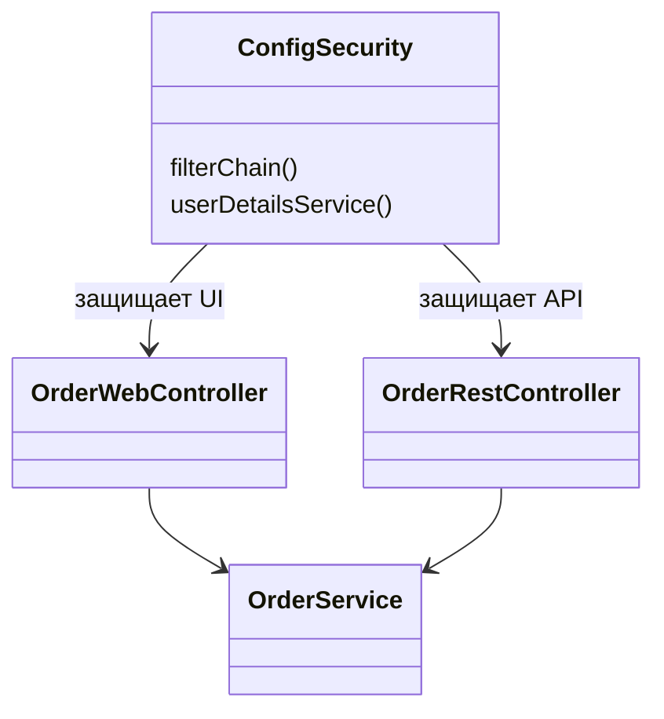

# Лабораторная работа 7. Spring Security

**Студентка:** Севрюкова Валерия Сергеевна  
**Группа:** 12002453  
**Тема:** Spring Security, form login и Basic Auth

## Цель

Добавить в магазин зоотоваров ролевой доступ: кто-то только смотрит заказы, а кто-то может всё менять.

## Что сделала

1. Скопировала ЛР6 в `les14/lab`.
2. Подключила Spring Security.
3. Добавила двух пользователей:
   - `user` / `user` — роль USER, только просмотр заказов
   - `manager` / `manager` — роль MANAGER, все операции
4. Для веб-интерфейса сделала вход через форму (`/login`).
5. Для REST оставила Basic Authentication (логин/пароль в Postman).
6. Собрала `gradle war`, проверила на Tomcat.

## Как пользоваться

Веб:
- http://localhost:8080/pet-store/login
- после входа открывается `/orders`

REST (Basic Auth):
- GET `/api/orders` — можно под user или manager
- POST/PUT/DELETE — только manager

## Правила доступа

| Что | user | manager |
|---|---|---|
| Смотреть список заказов | да | да |
| Создавать/менять/удалять в UI | нет | да |
| GET REST заказов | да | да |
| POST/PUT/DELETE REST | нет | да |

## UML

## Вывод

Добавила безопасность: форма для сайта и Basic Auth для REST. Роли USER и MANAGER работают как нужно.

## Вопросы к защите (коротко)

1. Spring Security — библиотека для аутентификации и авторизации.
2. Аутентификация — кто ты, авторизация — что тебе можно.
3. `SecurityFilterChain` — цепочка фильтров безопасности.
4. Form login — страница логина и cookie-сессия.
5. `UserDetailsService` отдаёт пользователя и роли.
6. Роли задаю в `User.withUsername(...).roles(...)`.
7. Basic Auth удобен для API/Postman.
8. Через `requestMatchers(...).hasRole(...)`.
9. Своя страница — `.loginPage("/login")`.
10. Да, form login и basic можно вместе, как у меня.
