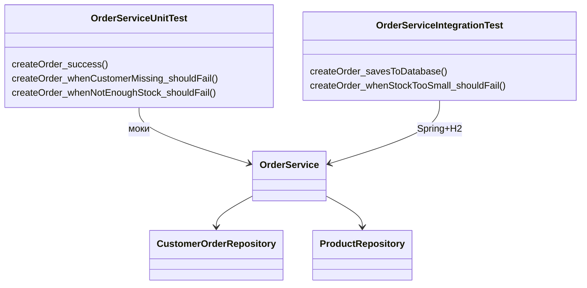

# Лабораторная работа 8. Основы тестирования

**Студентка:** Севрюкова Валерия Сергеевна  
**Группа:** 12002453  
**Тема:** unit-тесты, интеграционные тесты, JaCoCo

## Цель

Проверить сервис создания заказов тестами и посмотреть покрытие через JaCoCo.

## Что сделала

1. Скопировала результат ЛР6 в `les16/lab`.
2. Подключила JUnit 5, Mockito, AssertJ, Spring Test.
3. Настроила JaCoCo — отчёт в `build/jacocoHtml`.
4. Написала unit-тесты для `OrderService.createOrder`:
   - успешное создание
   - нет клиента
   - мало товара на складе
   - неверное количество
5. Написала интеграционные тесты сервиса с репозиториями и H2:
   - заказ реально сохраняется в БД
   - при ошибке заказ не создаётся
6. Прогнала тесты командой `gradle test`.

## Как запустить тесты

```text
cd les16/lab
gradle test
```

Отчёт покрытия:

```text
build/jacocoHtml/index.html
```

## Какие тесты где

- `OrderServiceUnitTest` — моки репозиториев, проверяю логику сервиса
- `OrderServiceIntegrationTest` — поднимается Spring-контекст и H2, проверяю связку сервис + репозитории

## UML



## Вывод

Добавила unit и интеграционные тесты на создание заказа. JaCoCo генерирует отчёт покрытия. Удачные и неудачные сценарии покрыла.

## Вопросы к защите (коротко)

1. Unit — один класс, интеграционный — несколько слоёв вместе.
2. JUnit, Mockito.
3. Моки подменяют зависимости.
4. В unit обычно бизнес-логику метода.
5. Через моки/стабы.
6. В чистом unit лучше без БД.
7. В интеграционном — что слои работают вместе.
8. Сервис + репозиторий + БД (у меня H2).
9. H2 быстрая и не нужна отдельная установка.
10. Если есть реальная БД/контекст Spring — это интеграционный.
